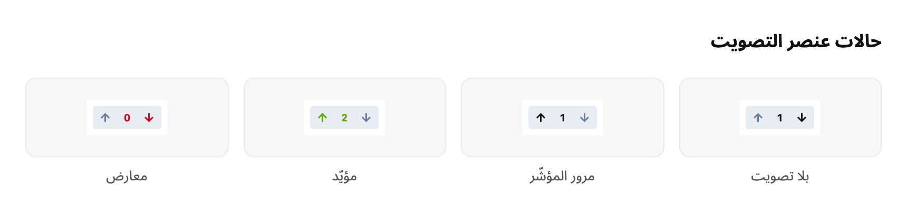

# Itqan Discussions

تصويت مؤيّد ومعارض على المشاركات، وترتيب النقاشات به.

<p align="center">
  
</p>

## ما فيها

- سهمان ونتيجة أسفل كل مشاركة، بتحديث فوري يتراجع إن فشل الطلب.
- النقر على السهم المختار يسحب الصوت، والنقر على الآخر يقلبه.
- لا يصوّت أحد على مشاركته: النتيجة قياسٌ لما رآه غيره.
- ترتيبان في قائمة النقاشات: **الأعلى تصويتًا** و**الأكثر تفاعلًا**.



## البنية

| الجدول | العمود | لماذا |
| :--- | :--- | :--- |
| `post_votes` | `(post_id, user_id)` مفتاحًا أساسيًا | صوت واحد لكل قارئ على كل مشاركة، تحسمه قاعدة البيانات |
| `post_votes` | `value` | `1` أو `-1`؛ والسحب حذفُ صفّ لا تصفير قيمة |
| `posts` | `votes` مفهرسًا | النتيجة المخزّنة، فلا يُجمَع الجدول عند العرض |
| `discussions` | `votes` مفهرسًا | نتيجة النقاش، من مشاركته الأولى |
| `discussions` | `hotness` مفهرسًا | ترتيب «الأكثر تفاعلًا» |

النتيجة محفوظة في ثلاثة مواضع، وهذا مقصود: قائمة النقاشات أكثر استعلامات المنتدى تشغيلًا، ولا تحتمل ضمّ جدول الأصوات وجمعه في كل صفّ. ولذلك تُعاد الحسبة من الصفوف عند كل تصويت — لا تُزاد واحدًا وتُنقص واحدًا — فالزيادة المتدرّجة تنحرف عند أول تعديل يأتي من مكان آخر، وإعادة الحساب على مشاركة واحدة رخيصة.

## «الأكثر تفاعلًا»

ترتيب Reddit: النتيجة على مقياس لوغاريتمي، يُضاف إليها عمر النقاش حدًّا مستقلًا.

```
sign(score) × log10(max(|score|, 1)) + seconds / 45000
```

فالفرق بين صوت وعشرة يزن ما يزنه الفرق بين عشرة ومئة، والعمر يرفع الجديد دون أن يُنقص القديم شيئًا. وكل ‎12.5‎ ساعة تزن ما تزنه مرتبة كاملة من النتيجة.

وأثره أن نقاشًا عمره سنة بأربعين صوتًا يتصدّر «الأعلى تصويتًا» ويهبط إلى آخر «الأكثر تفاعلًا» أمام نقاش اليوم بثلاثة أصوات.

## الإعجابات

التصويت يحلّ محلّ `flarum/likes`، فالإعجاب والصوت المؤيّد يسألان السؤال نفسه، وتشغيلهما معًا يقسم الجواب على تسجيلين.

وهجرة `convert_likes_to_votes` تنقل كل إعجاب قائم صوتًا مؤيّدًا، فلا يضيع تفاعل الأعضاء المتراكم. وهي قابلة للتكرار دون ازدواج، ولا تراجع لها: بعد النقل لا شيء يميّز إعجابًا محوَّلًا من صوت جاء بعده.

**بعد تفعيل هذه الإضافة، عطّل `flarum/likes` من لوحة الإدارة.** ولم يُحذف زرّ الإعجاب من الشيفرة: الإضافتان تكتبان في القائمة نفسها، وأيّهما تغلب يعتمد على ترتيب إقلاع فلاروم — وهو ما لا يُبنى عليه وجود زرّ من عدمه.

## واجهة الـAPI

```
PATCH /api/posts/{id}/vote
{ "data": { "attributes": { "vote": 1 } } }
```

`1` تأييد، `-1` معارضة، `0` سحب. وأي قيمة أخرى تُعامَل سحبًا لا تُكتب في الجدول. وتُعيد النقطة المشاركةَ بنتيجتها من الخادم، فيستبدل العميل تقديره المتفائل بالرقم المعتمد.

وتضيف الإضافة إلى `PostSerializer`: `votes` النتيجة، و`userVote` صوت القارئ نفسه، و`canVote`.

## التطوير

```bash
cd packages/itqan-discussions/js
npm install
npm run build
```
