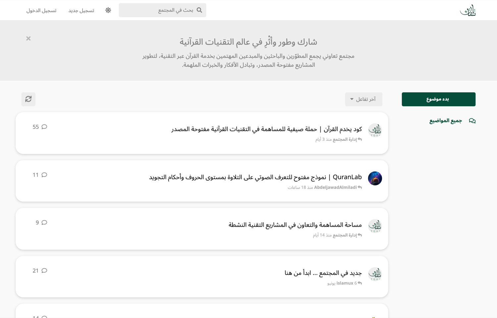
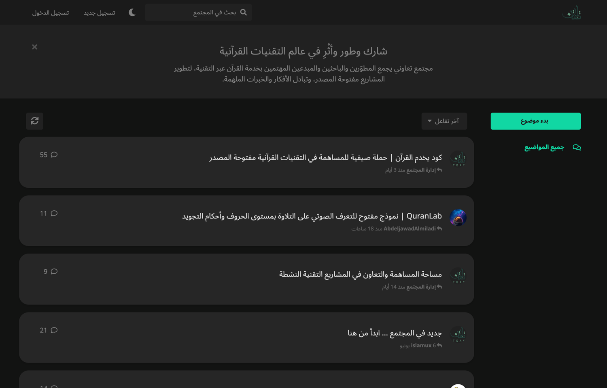
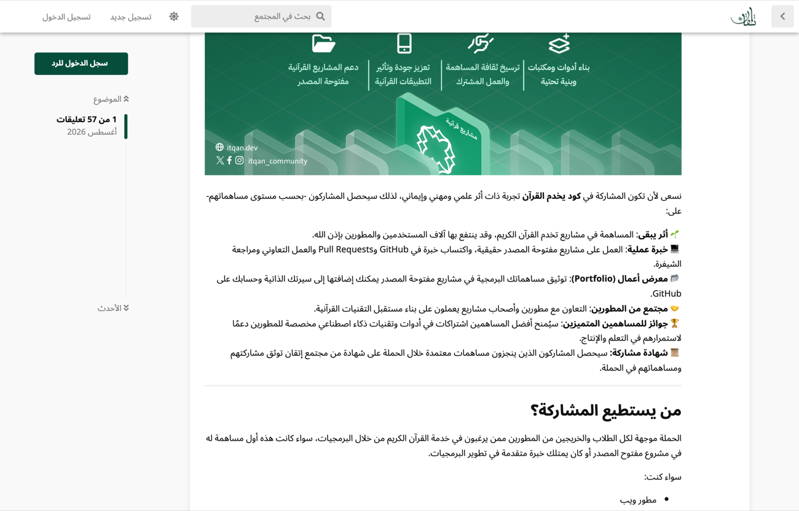
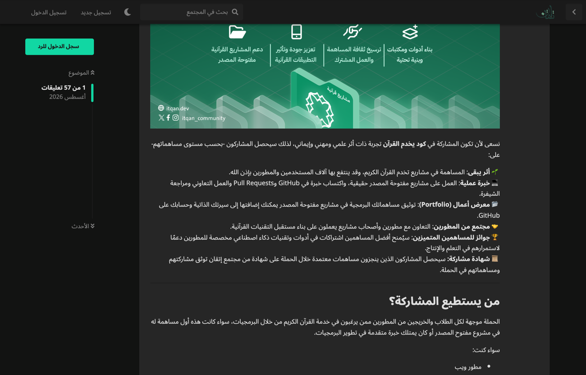
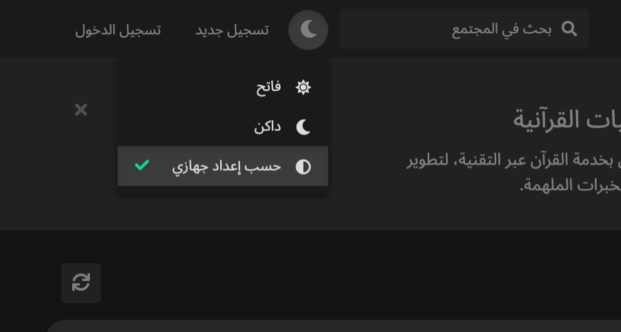

# Itqan Theme

وضع داكن وفاتح، يختاره كل عضو لنفسه.

| فاتح | داكن |
| :--- | :--- |
|  |  |
|  |  |

<p align="center">
  
</p>

## ما فيها

عنصر في الشريط العلوي يقدّم: فاتح، داكن، أو حسب إعداد الجهاز.

- اختيار العضو يُحفظ في حسابه فينتقل معه بين أجهزته، واختيار الزائر في متصفحه.
- المظهر يُكتب على `<html>` من الخادم قبل ظهور الصفحة، فلا ومضة بيضاء لمن اختار الداكن.
- «حسب إعداد جهازي» يتابع النظام لحظيًا بلا إعادة تحميل.
- المظهر الافتراضي للمنتدى يضبطه المشرف من صفحة الإضافة.

## كيف تعمل

ألوان فلاروم كلها معرّفة أصلًا كـ CSS custom properties في `:root`، وكل المكوّنات تقرأها منها. لكن لا سبيل لتغييرها بعد بناء ملفات LESS، ولذلك كان الوضع الداكن في فلاروم إعدادًا واحدًا للمنتدى كله.

فبدل بناء ثيم ثانٍ، تعيد الحزمة تعريف الألوان نفسها تحت `html[data-itqan-theme='light']` و`html[data-itqan-theme='dark']`. كلا الـselectorين ينطبق على العنصر الذي ينطبق عليه `:root` ويسبقه في الأولوية، فتغيير سمة واحدة يبدّل ألوان الموقع كله فورًا.

الألوان مشتقّة بنفس معادلات النواة في `common/variables.less`، فتبقى مرتبطة بألوان المنتدى المضبوطة في إعدادات المظهر، ويطابق الوضع الفاتح شكل المنتدى الحالي تمامًا. وثلاثة مواضع خالفتُ فيها هذه المعادلات، موثّقة في `less/forum/color-schemes.less`.

## الملفات

| الملف | ما فيه |
| :--- | :--- |
| `less/forum/color-schemes.less` | الألوان وكل ما يُشتق منها |
| `less/forum/compatibility.less` | الأسطح التي تُثبّت ألوانًا فاتحة بدل قراءتها |
| `less/forum/theme-switcher.less` | عنصر الشريط العلوي |
| `js/src/forum/utils/scheme.js` | قراءة الاختيار وتطبيقه وحفظه |
| `js/src/forum/components/ThemeSwitcher.js` | القائمة المنسدلة |
| `src/Content/ApplyStoredScheme.php` | السكربت الذي يمنع الومضة |

### عن `compatibility.less`

بعض الإضافات تستخدم متغيّر LESS ‏`@control-bg` بدل `var(--control-bg)`، فتتجمّد قيمته عند البناء وتبقى فاتحة مهما تغيّرت السمة. راجعتُ ملف الأنماط المبني للمنتدى، وجمعت كل حالة كهذه، وأعدت ربطها بالمتغيّر الذي اشتُقّت منه. القيمتان متطابقتان في الوضع الفاتح، فحُصر الملف في الداكن وحده.

وبطاقات النقاشات والمشاركات ونافذة الإشعارات مصدرها Custom LESS في إعدادات المظهر، لا حزمة في هذا المستودع. عولجت هنا مؤقتًا، والأولى نقل ذلك الـLESS إلى الحزمة.

## التطوير

```bash
cd packages/itqan-theme/js
npm install
npm run build
```

الملفات المبنية محفوظة في `js/dist`، كما في `packages/itqan-mailerlite`. وتعليقات الشيفرة بالإنجليزية، كبقية المستودع.
