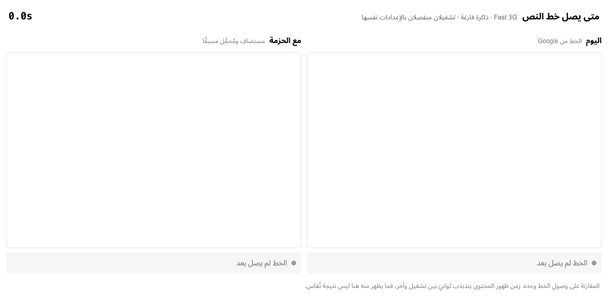
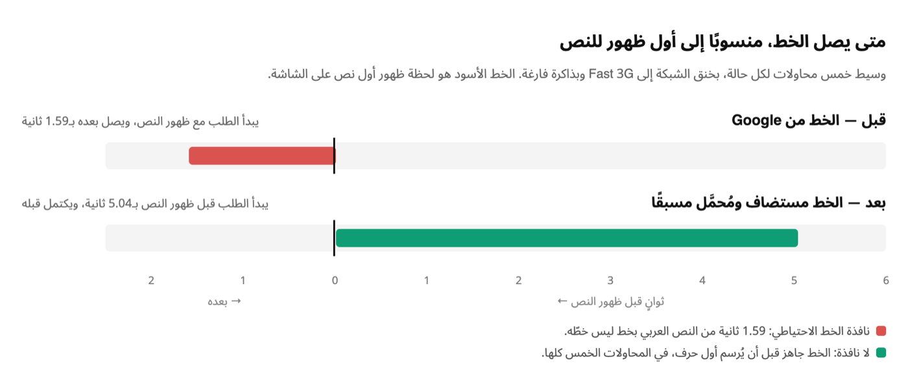
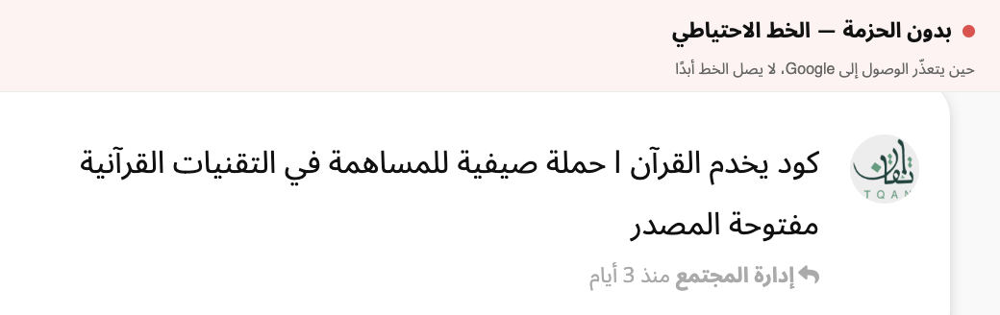

# Itqan Typography

خطوط النصّ العربي في المنتدى: مستضافة محليًا، تُطلب مع الصفحة لا بعدها.





## المشكلة

خط `Noto Sans Arabic` كان يأتي من Google. والمتصفح لا يعرف ملف الخط إلا بعد أن يجلب ملف الأنماط من `fonts.googleapis.com` ويقرأه، ثم ينزل الملف من `fonts.gstatic.com`. وفلاروم يبني الصفحة بالجافاسكربت، فلا يُطلب الخط أصلًا إلا بعد إقلاع التطبيق — أي بعد أن يكون النص قد ظهر بخط احتياطي.

والرابط كان يطلب `wght@100..900`، فينزل الخط المتغيّر بكل أوزانه بينما المنتدى لا يستعمل إلا ٤٠٠ و٦٠٠ و٧٠٠.

## ما تفعله الحزمة

1. تستضيف الخط في `assets/fonts` بدل Google.
2. تضيّق محور الوزن من `100..900` إلى `400..700`، فينزل النطاق العربي من ١٦٦ كيلوبايت إلى ٩٠.
3. تعمل `preload` للنطاق العربي من `extend.php`، فيبدأ التنزيل مع الصفحة لا بعد إقلاع التطبيق.
4. تحذف وسوم Google من الـhead. هذا ليس ترتيبًا: تلك الوسوم تُضاف عبر HTML Head بعد روابط الأنماط، فتُصرَّح `@font-face` الخاصة بـGoogle أخيرًا وتتغلّب على الخط المستضاف هنا.

## حين يتعذّر الوصول إلى Google

هذه ليست حالة نظرية عند جمهور هذا المنتدى. وما دام الخط عند طرف ثالث، فتعذُّر الوصول إليه يعني بقاء النص كله بخط احتياطي:



## الملفات

| الملف | ما فيه |
| :--- | :--- |
| `assets/fonts/` | ملفات `woff2` ونصّ رخصة OFL |
| `less/forum/fonts.less` | تعريفات `@font-face` والخط الاحتياطي |
| `src/Fonts.php` | مواضع الملفات، وأيّها يستحق `preload` |
| `src/Content/DropRemoteFontLinks.php` | حذف وسوم Google من الـhead |

## عن الخط الاحتياطي

صندوق السطر في Noto مرتفع بشكل غير معتاد: صعود ١٣٧٤ وهبوط ٧٣٨ مقابل em مقداره ١٠٠٠، فيشغل السطر ‎2.112em‎ بينما يشغل نحو ‎1.3em‎ في الخطوط الاحتياطية. قِستُ في Chrome عند حجم ١٠٠ بكسل: الفقرة العربية نفسها ارتفاعها ٢١١ بكسل في Noto، وبين ١٢١ و١٥٠ في الاحتياطية. ولذلك يُضبط `ascent-override` و`descent-override` على قيم Noto نفسها، فيغيّر التبديلُ شكلَ الحروف دون أن يزحزح السطر، والأرقام مضبوطة ومتطابقة على كل نظام.

أمّا `size-adjust` فمتروك عمدًا. مطابقة عروض Noto تحتاج ١١٨٪ أمام `sans-serif` على هذا الجهاز، و٩٦٪ أمام Tahoma، و١٤٥٪ أمام Al Bayan — قياسًا لا تخمينًا. فلا قيمة واحدة تصلح للجميع، والقيمة الخاطئة تزحزح نصًّا كان سيثبت.

## الرخصة

الخط تحت رخصة SIL Open Font License 1.1، ونصّها في `assets/fonts/OFL.txt`. ولم يُشحن النطاقان `math` و`symbols` لأن المنتدى لا يُكتب بهما، وخطوط النظام تغطي رموزهما.

## إعادة توليد الملفات

```bash
# النطاقات كما تخدمها Google، ثم تضييق محور الوزن
fonttools ttLib.woff2 decompress google-arabic.woff2
fonttools varLib.instancer google-arabic.ttf "wght=400:700" -o trim.ttf
fonttools ttLib.woff2 compress trim.ttf
```
